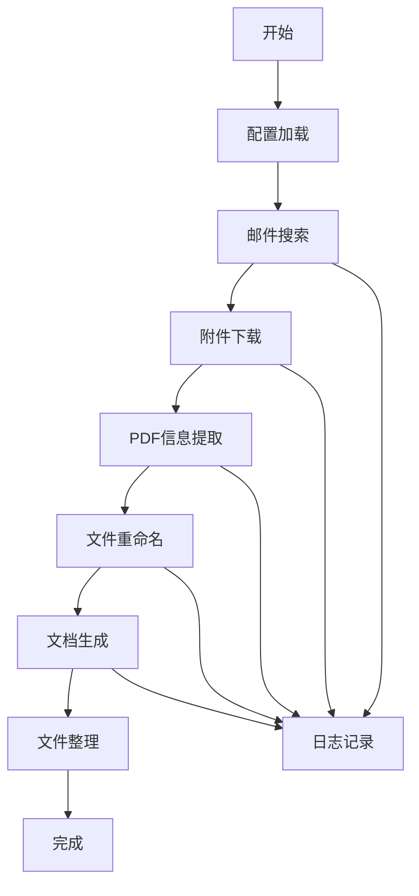

# 工作流程说明

## 完整处理流程



## 详细步骤

### 1. 配置加载
- 读取配置文件（JSON格式）
- 验证配置有效性
- 设置日志记录

### 2. 邮件搜索
- 连接到邮箱服务器（IMAP）
- 按条件搜索邮件：
  - 发件人过滤
  - 主题关键词过滤
  - 日期范围过滤
  - 附件存在检查
- 返回邮件ID和基本信息

### 3. 附件下载
- 遍历搜索到的邮件
- 识别PDF和ZIP附件
- 下载附件到本地目录
- 解压ZIP文件（如果存在）
- 记录下载结果

### 4. PDF信息提取
- 针对不同类型的PDF使用不同的解析器：
  - **12306火车票**：提取日期、时间、起点、终点、车次、金额
  - **滴滴出行**：提取日期、起点、终点、金额（发票和行程单配对）
- 保存提取的信息到JSON文件

### 5. 文件重命名
- 根据提取的信息重命名文件：
  - 12306格式：`YYYYMMDD_HHMM_起点-终点_车次.pdf`
  - 滴滴格式：`YYYYMMDD_滴滴_起点_终点_行程单/发票.pdf`
- 处理文件名冲突（添加数字后缀）

### 6. 文档生成
- 创建Word文档
- 添加汇总表格（按时间顺序）
- 添加PDF原图（转换为图片）
- 添加统计信息
- 保存文档

### 7. 文件整理
- 整理处理后的文件
- 清理临时文件
- 生成处理报告

## 配置驱动的工作流

### 配置文件结构

```json
{
  "workflow": {
    "steps": ["search", "download", "extract", "rename", "document"],
    "skip_steps": [],
    "parallel_processing": false
  },
  "email": { ... },
  "search": { ... },
  "processing": { ... },
  "document": { ... }
}
```

### 可跳过的步骤

可以通过配置跳过某些步骤：

```json
{
  "workflow": {
    "skip_steps": ["rename", "document"],
    "output_dir": "./raw_attachments"
  }
}
```

## 错误处理流程

### 错误类型

1. **连接错误**：邮箱服务器连接失败
2. **认证错误**：用户名/密码错误
3. **解析错误**：PDF格式不支持
4. **文件错误**：文件读写权限问题
5. **配置错误**：配置文件格式错误

### 错误恢复

- 记录详细错误信息
- 尝试继续处理其他文件
- 生成错误报告
- 提供重试机制

## 性能优化

### 批量处理
- 一次连接处理多封邮件
- 批量下载附件
- 并行处理PDF（如果支持）

### 缓存机制
- 缓存邮件搜索结果
- 缓存PDF提取结果
- 避免重复处理

### 内存管理
- 流式处理大文件
- 及时释放资源
- 监控内存使用

## 扩展点

### 自定义处理步骤
可以通过继承基类添加自定义处理步骤：

```python
class CustomProcessor(BaseProcessor):
    def process(self, file_path, config):
        # 自定义处理逻辑
        pass
```

### 插件系统
支持插件扩展：
- 新的PDF解析器
- 新的输出格式
- 新的邮件过滤器

## 最佳实践

### 1. 分阶段处理
```bash
# 第一阶段：收集数据
python scripts/search_emails.py --config config.json
python scripts/download_attachments.py --config config.json

# 第二阶段：处理数据
python scripts/extract_pdf_info.py --config config.json
python scripts/rename_files.py --config config.json

# 第三阶段：生成输出
python scripts/create_summary_doc.py --config config.json
```

### 2. 增量处理
- 记录已处理的邮件ID
- 只处理新邮件
- 支持断点续传

### 3. 验证检查
- 处理前后文件数量检查
- 金额总和验证
- 文件完整性检查

## 监控和日志

### 日志级别
- DEBUG：详细处理信息
- INFO：关键步骤信息
- WARNING：非致命错误
- ERROR：处理失败
- CRITICAL：系统错误

### 进度监控
- 显示当前处理步骤
- 显示处理进度百分比
- 预估剩余时间

## 输出文件结构

```
output/
├── raw/                    # 原始下载文件
│   ├── emails.json        # 邮件搜索结果
│   └── attachments/       # 原始附件
├── processed/             # 处理后的文件
│   ├── info.json         # 提取的信息
│   ├── renamed/          # 重命名后的文件
│   └── images/           # 转换的图片
├── documents/             # 生成的文档
│   └── 报销汇总.docx     # 最终文档
└── logs/                  # 日志文件
    ├── process.log       # 处理日志
    └── errors.log        # 错误日志
```